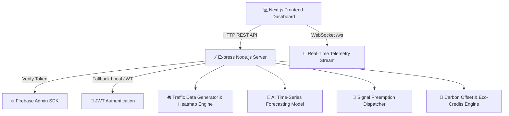

# 🌊 Safe-Flow: AI-Powered Eco-Friendly Urban Mobility & Smart Traffic Platform

[](https://nextjs.org/)
[](https://expressjs.com/)
[](https://developer.mozilla.org/en-US/docs/Web/API/WebSockets_API)
[](https://firebase.google.com/)
[](LICENSE)

> **Safe-Flow** is a next-generation, AI-driven urban mobility platform designed to alleviate city traffic congestion, preempt emergency response delays, optimize zero-emission multimodal transit, and quantify carbon offsets in real time.

---

## 📸 Platform Highlights & Vision

- 🚦 **Real-Time Congestion & Heatmaps**: Instant IoT sensor updates and live visual congestion metrics per city zone.
- 🔮 **AI Predictive Congestion Forecasting**: 1-hour, 3-hour, and 6-hour predictive traffic modeling based on historical time-series analytics.
- 🚨 **Emergency Green Wave Preemption**: Priority signal synchronization and emergency corridor allocation for ambulances, fire engines, and police.
- 🌿 **Emissions Tracking & Carbon Offset Engine**: Precise CO₂, NOx, and PM2.5 monitoring paired with a gamified carbon credit leaderboard.
- 🚆 **Multimodal Zero-Emission Routing**: Integrated route optimizer combining EV transit, metro networks, e-scooters, and dedicated green walkways.
- 🔐 **Dual Authentication System**: Support for both Firebase Auth (Google, GitHub, Email) and local JWT security.

---

## 🏗️ System Architecture



---

## ⚡ Quick Start Guide

### Prerequisites
- **Node.js**: v18.x or higher
- **npm**: v9.x or higher

### 1. Clone & Set Up Backend

```bash
cd backend
npm install
npm run dev
```
The backend server runs at `http://localhost:4000` with WebSocket telemetry at `ws://localhost:4000/ws`.

#### Test Credentials (Local Mode):
- **Admin**: `admin@smartcity.gov` / `admin123`
- **Fleet Manager**: `fleet@transport.com` / `fleet123`
- **Citizen**: `citizen@email.com` / `citizen123`

---

### 2. Set Up Frontend

```bash
cd frontend
npm install
npm run dev
```
Open `http://localhost:3000` in your browser to access the interactive web console.

---

## 🔑 Environment Variables Configuration

Create a `.env.local` file inside the `frontend` folder and `.env` inside `backend`:

### Backend `.env`
```env
PORT=4000
JWT_SECRET=your-custom-jwt-secret-key
FIREBASE_PROJECT_ID=your-firebase-project-id
# Optional: FIREBASE_SERVICE_ACCOUNT={"type":"service_account",...}
```

### Frontend `.env.local`
```env
NEXT_PUBLIC_API_URL=http://localhost:4000/api
NEXT_PUBLIC_AUTH_MODE=local # 'local' or 'firebase'
NEXT_PUBLIC_FIREBASE_API_KEY=your_api_key
NEXT_PUBLIC_FIREBASE_AUTH_DOMAIN=your_project.firebaseapp.com
NEXT_PUBLIC_FIREBASE_PROJECT_ID=your_project_id
NEXT_PUBLIC_FIREBASE_STORAGE_BUCKET=your_project.appspot.com
NEXT_PUBLIC_FIREBASE_MESSAGING_SENDER_ID=your_sender_id
NEXT_PUBLIC_FIREBASE_APP_ID=your_app_id
```

---

## 📡 API Reference Manual

### Authentication Routes
| Method | Endpoint | Description |
| :--- | :--- | :--- |
| `POST` | `/api/auth/login` | Local JWT authentication with email & password |
| `POST` | `/api/auth/register` | Register new user account |
| `POST` | `/api/auth/firebase-login` | Sync Firebase OAuth tokens with backend JWT |
| `GET` | `/api/auth/me` | Retrieve authenticated user profile |

### Core Traffic & Emissions Routes
| Method | Endpoint | Description |
| :--- | :--- | :--- |
| `GET` | `/api/traffic/realtime` | Real-time congestion metrics for all city zones |
| `GET` | `/api/traffic/heatmap` | Heatmap coordinate intensity data |
| `GET` | `/api/emissions/realtime` | CO₂, NOx, and PM2.5 levels across zones |
| `POST` | `/api/routes/optimize` | Route optimization (Fastest vs Eco vs Balanced) |
| `GET` | `/api/alerts` | Active traffic incidents and weather advisories |

### AI & Future Scope Routes
| Method | Endpoint | Description |
| :--- | :--- | :--- |
| `GET` | `/api/routes/predictive-traffic` | AI predictive traffic forecast (1h, 3h, 6h horizon) |
| `POST` | `/api/routes/emergency-corridor` | Dispatch Green Wave signal preemption |
| `POST` | `/api/emissions/offset-calculator` | Monthly carbon offset & tree offset calculation |
| `GET` | `/api/gamification/leaderboard` | Community eco-commuter credit leaderboard |
| `POST` | `/api/routes/multimodal` | Multimodal transit route generator |

---

## 🔮 Future Scope & Strategic Roadmap

- [x] **Phase 1: Real-time Telemetry & Eco Routing** - Dynamic congestion mapping & CO₂ optimization.
- [x] **Phase 2: Firebase Auth & Role-Based Access** - Cloud OAuth & multi-tenant user roles.
- [x] **Phase 3: AI Predictive Engine & Green Wave Preemption** - Emergency signal control & AI time-series forecasting.
- [ ] **Phase 4: Autonomous Vehicle V2X Integration** - Vehicle-to-Everything communication protocols & Smart City IoT sensors.
- [ ] **Phase 5: Blockchain Carbon Credit Settlement** - Tokenized carbon credits on eco-friendly layer-2 ledgers.

---

## 📄 License

Distributed under the MIT License. See `LICENSE` for more information.

---
*Created with ❤️ by Monishwaran for sustainable urban smart cities.*
