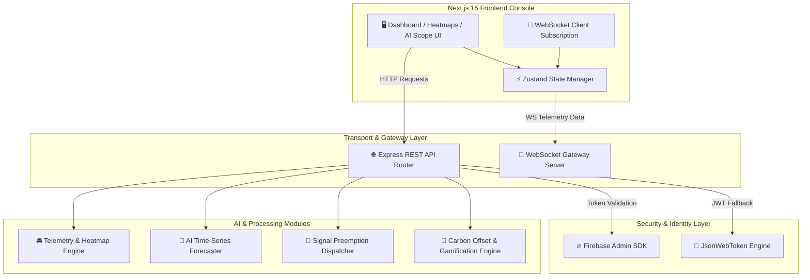

# 🌊 Safe-Flow: AI-Powered Eco-Friendly Urban Mobility & Smart Traffic Platform

[](https://nextjs.org/)
[](https://expressjs.com/)
[](https://developer.mozilla.org/en-US/docs/Web/API/WebSockets_API)
[](https://firebase.google.com/)
[](https://www.typescriptlang.org/)
[](LICENSE)

> **Safe-Flow** is an enterprise-grade, AI-driven urban mobility platform designed to mitigate urban traffic congestion, preempt emergency response delays, optimize zero-emission multimodal transit networks, and quantify real-time carbon offsets.

---

## 📋 Table of Contents

1. [System Overview & Key Features](#-system-overview--key-features)
2. [Technical Architecture & Data Flow](#-technical-architecture--data-flow)
3. [Deep-Dive Module Breakdown](#-deep-dive-module-breakdown)
   - [Real-Time Telemetry & Heatmap Engine](#1-real-time-telemetry--heatmap-engine)
   - [AI Time-Series Predictive Forecasting](#2-ai-time-series-predictive-forecasting)
   - [Emergency Green Wave Preemption](#3-emergency-green-wave-preemption)
   - [Carbon Offset & Eco-Credits Engine](#4-carbon-offset--eco-credits-engine)
   - [Multimodal Zero-Emission Routing](#5-multimodal-zero-emission-routing)
   - [Dual Authentication System](#6-dual-authentication-system)
4. [Data Schemas & Dictionary](#-data-schemas--dictionary)
5. [Complete REST API Reference & Payloads](#-complete-rest-api-reference--payloads)
6. [WebSocket Protocol & Event Stream](#-websocket-protocol--event-stream)
7. [Environment Variables & Setup Guide](#-environment-variables--setup-guide)
8. [Future Strategic Roadmap](#-future-strategic-roadmap)
9. [Contributing & License](#-contributing--license)

---

## 🌟 System Overview & Key Features

Modern urban centers suffer from traffic bottlenecks, rising carbon footprints, and delayed emergency response vehicles. **Safe-Flow** addresses these challenges through a unified smart city platform that integrates IoT sensor streaming, predictive analytics, signal preemption, and green commuter gamification.

### Key Pillars:
- 🚦 **Real-Time Congestion & Heatmap Monitoring**: Live IoT sensor streaming and spatial density mapping for city sectors.
- 🔮 **AI Predictive Congestion Engine**: Time-series forecasting for 1-hour, 3-hour, and 6-hour horizons with confidence metrics.
- 🚨 **Emergency Green Wave Signal Preemption**: Active traffic light overrides for emergency vehicles (Ambulances, Fire Engines, Police).
- 🌿 **Emissions Analytics & Carbon Offset Engine**: Granular tracking of CO₂, NOx, and PM2.5 emissions linked to carbon credits and tree planting equivalencies.
- 🚆 **Multimodal Zero-Emission Router**: Intelligent travel combinations pairing EV shuttles, metro, e-scooters, and walking paths.
- 🔐 **Hybrid Firebase & Local JWT Authentication**: Cloud OAuth integration alongside enterprise fallback authentication.

---

## 🏗️ Technical Architecture & Data Flow



---

## 🏎️ Deep-Dive Module Breakdown

### 1. Real-Time Telemetry & Heatmap Engine
- Aggregates zone metrics: vehicle density, average velocity (km/h), incident frequency, and congestion percentages.
- Heatmap generator maps spatial coordinates `(lat, lng)` and calculates normalized intensity values `(0.0 - 1.0)`.

### 2. AI Time-Series Predictive Forecasting
- Evaluates temporal rush-hour trends, zone classification (Commercial, Residential, Industrial, Transport Hubs), and historical variance.
- Outputs 1-hour, 3-hour, and 6-hour forecast horizons with automated operational recommendations (e.g., *"Activate Signal Optimization"* vs *"Normal Flow Monitoring"*).

### 3. Emergency Green Wave Preemption
- Simulates priority corridor allocation between origin and destination zones.
- Overrides traffic signal phases ahead of emergency response vehicles, delivering time savings of 8–15 minutes per dispatch.

### 4. Carbon Offset & Eco-Credits Engine
- Converts vehicle mileage and powertrain factors (Gasoline: 0.21 kg CO₂/km, SUV: 0.28, Hybrid: 0.11, EV: 0.05) into total monthly carbon output.
- Calculates tree planting offset requirements (based on ~21.77 kg CO₂ absorption per tree per year) and awards Eco-Credits for sustainable choices.

### 5. Multimodal Zero-Emission Routing
- Recommends zero-emission journey plans combining public EV transport, high-speed rail/metro, micro-mobility e-scooters, and dedicated pedestrian corridors.

### 6. Dual Authentication System
- Seamlessly handles Firebase OAuth 2.0 (Google, GitHub, Email/Password) when configured, falling back to local bcrypt-encrypted JWT tokens for offline/standalone execution.

---

## 🗄️ Data Schemas & Dictionary

### User Model
```json
{
  "id": "string (UUID or Firebase UID)",
  "email": "string",
  "name": "string",
  "role": "admin | fleet_manager | citizen",
  "avatar": "string (Initials)",
  "provider": "email | google | github | firebase"
}
```

### Traffic Zone Model
```json
{
  "zoneId": "string",
  "zoneName": "string",
  "lat": "number",
  "lng": "number",
  "congestionLevel": "number (0-100%)",
  "congestionCategory": "Low | Medium | High",
  "averageSpeed": "number (km/h)",
  "vehicleCount": "number",
  "incidents": "number",
  "timestamp": "ISO-8601 String"
}
```

### Predictive Zone Model
```json
{
  "zoneId": "string",
  "zoneName": "string",
  "currentCongestion": "number",
  "forecast1h": "number",
  "forecast3h": "number",
  "forecast6h": "number",
  "trend": "Improving | Worsening",
  "confidenceScore": "number (0-100%)",
  "suggestedAction": "string"
}
```

---

## 📡 Complete REST API Reference & Payloads

### 1. User Login (`POST /api/auth/login`)
**Request Body:**
```json
{
  "email": "admin@smartcity.gov",
  "password": "admin123"
}
```
**Response:**
```json
{
  "token": "eyJhbGciOiJIUzI1NiIsInR5cCI6...",
  "user": {
    "id": "1",
    "email": "admin@smartcity.gov",
    "name": "City Admin",
    "role": "admin",
    "avatar": "CA"
  }
}
```

---

### 2. AI Predictive Traffic (`GET /api/routes/predictive-traffic`)
**Headers:** `Authorization: Bearer <token>`  
**Response Sample:**
```json
{
  "predictions": [
    {
      "zoneId": "z1",
      "zoneName": "Downtown Core",
      "currentCongestion": 68,
      "forecast1h": 74,
      "forecast3h": 82,
      "forecast6h": 45,
      "trend": "Worsening",
      "confidenceScore": 94.2,
      "suggestedAction": "Activate Signal Optimization"
    }
  ],
  "generatedAt": "2026-09-22T22:45:00.000Z"
}
```

---

### 3. Emergency Green Wave Dispatch (`POST /api/routes/emergency-corridor`)
**Request Body:**
```json
{
  "vehicleType": "Ambulance",
  "originZone": "Downtown Core",
  "destinationZone": "Airport Hub"
}
```
**Response Sample:**
```json
{
  "corridorId": "CORRIDOR-4812",
  "vehicleType": "Ambulance",
  "status": "ACTIVE_GREEN_WAVE",
  "origin": "Downtown Core",
  "destination": "Airport Hub",
  "signalsSynchronized": 7,
  "estimatedTimeSavedMin": 12,
  "priorityLevel": "HIGH_PRIORITY_PREEMPTION",
  "dispatchTimestamp": "2026-09-22T22:45:00.000Z"
}
```

---

### 4. Carbon Offset Calculator (`POST /api/emissions/offset-calculator`)
**Request Body:**
```json
{
  "monthlyKm": 450,
  "vehicleType": "car"
}
```
**Response Sample:**
```json
{
  "monthlyKm": 450,
  "vehicleType": "car",
  "monthlyCO2Kg": 94.5,
  "yearlyCO2Tonnes": 1.13,
  "treesNeededToOffset": 53,
  "ecoCreditsEarnable": 180,
  "suggestedOffsets": [
    {
      "provider": "City Green Canopy Program",
      "costUsd": 133,
      "treesPlanted": 53
    }
  ]
}
```

---

## 📡 WebSocket Protocol & Event Stream

Connect to WebSocket endpoint: `ws://localhost:4000/ws`

### Incoming Messages:

#### 1. Traffic Telemetry Broadcast (`traffic_update` - every 5s)
```json
{
  "type": "traffic_update",
  "data": [
    { "zoneId": "z1", "congestionLevel": 65, "vehicleCount": 1120, ... }
  ],
  "timestamp": "2026-09-22T22:45:00.000Z"
}
```

#### 2. Emission Broadcast (`emission_update` - every 10s)
```json
{
  "type": "emission_update",
  "data": [
    { "zoneId": "z1", "co2Emission": 134.4, "airQualityIndex": 85, ... }
  ],
  "timestamp": "2026-09-22T22:45:00.000Z"
}
```

#### 3. Real-Time Alert Broadcast (`alert` - on event)
```json
{
  "type": "alert",
  "data": {
    "id": "alert-901",
    "type": "congestion",
    "severity": "high",
    "title": "Heavy Congestion Detected",
    "zone": "Downtown Core",
    "message": "Traffic speed dropped below 10 km/h."
  }
}
```

---

## ⚙️ Environment Variables & Setup Guide

### 1. Backend Environment Setup (`backend/.env`)
```env
PORT=4000
JWT_SECRET=your-secure-jwt-secret-key-2026
FIREBASE_PROJECT_ID=your-firebase-project-id
# Optional: FIREBASE_SERVICE_ACCOUNT={"type":"service_account",...}
```

### 2. Frontend Environment Setup (`frontend/.env.local`)
```env
NEXT_PUBLIC_API_URL=http://localhost:4000/api
NEXT_PUBLIC_AUTH_MODE=local # 'local' or 'firebase'
NEXT_PUBLIC_FIREBASE_API_KEY=your_api_key
NEXT_PUBLIC_FIREBASE_AUTH_DOMAIN=your_project.firebaseapp.com
NEXT_PUBLIC_FIREBASE_PROJECT_ID=your_project_id
NEXT_PUBLIC_FIREBASE_STORAGE_BUCKET=your_project.appspot.com
NEXT_PUBLIC_FIREBASE_MESSAGING_SENDER_ID=your_sender_id
NEXT_PUBLIC_FIREBASE_APP_ID=your_app_id
```

### 3. Execution Commands

#### Run Backend:
```bash
cd backend
npm install
npm run dev
```

#### Run Frontend:
```bash
cd frontend
npm install
npm run dev
```

---

## 🔮 Future Strategic Roadmap

- [x] **Phase 1: Telemetry & Eco Routing** - Dynamic congestion mapping & CO₂ optimization.
- [x] **Phase 2: Hybrid Authentication** - Firebase OAuth & local JWT role-based security.
- [x] **Phase 3: AI Predictive Engine & Signal Preemption** - AI 1h-6h forecasts & emergency corridors.
- [ ] **Phase 4: V2X & Autonomous Fleet Protocol** - Direct Vehicle-to-Infrastructure (V2I) telemetry.
- [ ] **Phase 5: Blockchain Carbon Offset Settlement** - Tokenized carbon credits on eco-friendly layer-2 blockchains.

---

## 📄 License

Distributed under the **MIT License**. See `LICENSE` for details.

---
*Developed with ❤️ by Monishwaran for sustainable urban smart cities.*
