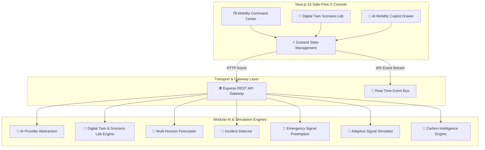

# 🚦 SAFE-FLOW X

## AI Mobility Intelligence & Smart City Digital Twin Platform

[](https://nextjs.org/)
[](https://expressjs.com/)
[](https://developer.mozilla.org/en-US/docs/Web/API/WebSockets_API)
[](https://firebase.google.com/)
[](https://www.typescriptlang.org/)
[](LICENSE)

> **Safe-Flow X** is an enterprise-grade AI Mobility Intelligence and Smart City Digital Twin platform. It elevates urban traffic management into an autonomous feedback loop: **OBSERVE → UNDERSTAND → PREDICT → SIMULATE → OPTIMIZE → ACT → LEARN**.

---

## 📋 Table of Contents

1. [System Architecture & Vision](#-system-architecture--vision)
2. [Core Subsystems & AI Modules](#-core-subsystems--ai-modules)
   - [AI Mobility Copilot](#1-ai-mobility-copilot)
   - [Next-Gen Traffic Prediction Engine](#2-next-gen-traffic-prediction-engine)
   - [AI Incident Detection Engine](#3-ai-incident-detection-engine)
   - [Smart City Digital Twin & Scenario Lab](#4-smart-city-digital-twin--scenario-lab)
   - [Emergency Response Orchestrator](#5-emergency-response-orchestrator)
   - [Adaptive Signal Simulator](#6-adaptive-signal-simulator)
   - [Multimodal AI Routing](#7-multimodal-ai-routing)
   - [City Carbon Intelligence & Eco-Credits 2.0](#8-city-carbon-intelligence--eco-credits-20)
   - [System Health & Chaos Simulation](#9-system-health--chaos-simulation)
3. [Complete API Reference Manual](#-complete-api-reference-manual)
4. [WebSocket Real-Time Telemetry Stream](#-websocket-real-time-telemetry-stream)
5. [Environment Variables & Setup Guide](#-environment-variables--setup-guide)
6. [4-Stage Smart City Roadmap](#-4-stage-smart-city-roadmap)
7. [License & Acknowledgments](#-license--acknowledgments)

---

## 🏗️ System Architecture & Vision



---

## 🏎️ Core Subsystems & AI Modules

### 1. AI Mobility Copilot
- **Endpoint**: `POST /api/ai/copilot`
- **Capabilities**: Natural language intent recognition (`TRAFFIC_ANALYSIS`, `ECO_ROUTE`, `PREDICTION_QUERY`, `EMERGENCY_DISPATCH`, `SCENARIO_SIMULATION`), live application telemetry retrieval, explainable answers, confidence scoring, and source referencing.
- **Provider Abstraction**: `AIProvider` interface supporting Gemini API, Groq, and fallback explainability engines.

### 2. Next-Gen Traffic Prediction Engine
- **Endpoint**: `GET /api/ai/traffic-forecast`
- **Horizons**: 15m, 30m, 1h, 2h, 3h, 6h, 12h, 24h forecasts.
- **Strategies**: `BASELINE`, `MOVING_AVERAGE`, `TIME_SERIES`, `ML_SIMULATION`.
- **Metrics**: Congestion %, Average Velocity (km/h), Vehicle Volume, Queue Length (m), Incident Risk, and CO₂ Emissions.

### 3. AI Incident Detection Engine
- **Endpoint**: `POST /api/incidents/detect`
- **Features**: Real-time anomaly detection for sudden speed drops, volume spikes, and road blockages with severity rating and delay impact estimations.

### 4. Smart City Digital Twin & Scenario Lab
- **Endpoints**: `POST /api/digital-twin/simulate` & `POST /api/scenarios/compare`
- **Parameters**: Traffic volume adjustments (±50%), emergency road closures, adverse rain/weather events, and EV adoption rate scaling.
- **Output**: Before vs after comparison metrics for congestion, average delay, and hourly CO₂.

### 5. Emergency Response Orchestrator
- **Endpoints**: `POST /api/emergency/dispatch`, `GET /api/emergency/:id`, `DELETE /api/emergency/:id/cancel`
- **Supported Vehicles**: Ambulances, Fire Engines, Police Patrols, Disaster Response Units.
- **Capabilities**: Green wave signal preemption, conflict intersection management, and live response efficiency tracking.

### 6. Adaptive Signal Simulator
- **Endpoint**: `POST /api/signals/optimize`
- **Phases**: Dynamic North/South and East/West phase adjustments based on queue length and demand mode (`NORMAL`, `PEAK`, `EMERGENCY`, `LOW_TRAFFIC`).

### 7. Multimodal AI Routing
- **Endpoint**: `POST /api/routes/intelligent-multimodal`
- **Strategies**: `FASTEST`, `CHEAPEST`, `ECO`, `BALANCED`, `LOW_WALKING`, `PUBLIC_TRANSIT`.
- **Breakdown**: Detailed scoring per strategy with transparent reasoning explanations.

### 8. City Carbon Intelligence & Eco-Credits 2.0
- **Endpoints**: `/api/emissions/forecast`, `/api/emissions/hotspots`, `/api/eco/credits`, `/api/eco/badges`, `/api/eco/challenges`
- **Features**: City emission hotspot heatmaps, weekly eco-commute challenges, and earnable badges (*Green Starter*, *Carbon Cutter*, *Transit Champion*, *EV Explorer*, *Eco Hero*).

### 9. System Health & Chaos Simulation
- **Endpoint**: `GET /api/system/health`
- **Capabilities**: Microservice health monitoring (Backend, DB, AI Engine, Telemetry, WebSocket) and developer chaos failure injection panel to test graceful UI degradation.

---

## 📡 Complete API Reference Manual

| Category | Method | Endpoint | Description |
| :--- | :--- | :--- | :--- |
| **Copilot** | `POST` | `/api/ai/copilot` | Execute natural language query with context retrieval |
| **Prediction** | `GET` | `/api/ai/traffic-forecast` | Multi-horizon 15m-24h traffic prediction |
| **Incidents** | `POST` | `/api/incidents/detect` | Run incident anomaly detection |
| **Digital Twin**| `POST` | `/api/digital-twin/simulate`| Execute digital twin scenario simulation |
| **Scenario Lab**| `POST` | `/api/scenarios/compare` | Compare baseline vs simulated scenarios |
| **Emergency** | `POST` | `/api/emergency/dispatch` | Dispatch green wave emergency corridor |
| **Signals** | `POST` | `/api/signals/optimize` | Optimize adaptive signal phase timings |
| **Multimodal** | `POST` | `/api/routes/intelligent-multimodal` | Intelligent strategy route solver |
| **Emissions** | `GET` | `/api/emissions/hotspots` | Retrieve city carbon hotspot zones |
| **Eco Credits** | `GET` | `/api/eco/credits` | Fetch user eco-credits, badges & challenges |
| **Health** | `GET` | `/api/system/health` | System health status & microservice latency |
| **Audit** | `GET` | `/api/audit` | Admin security audit log stream |

---

## ⚙️ Environment Variables & Setup Guide

### 1. Backend Configuration (`backend/.env`)
```env
PORT=4000
JWT_SECRET=your-custom-jwt-secret-key-2026
AI_PROVIDER=gemini-fallback # 'gemini' or 'gemini-fallback'
GEMINI_API_KEY=your_gemini_api_key
FIREBASE_PROJECT_ID=your-firebase-project-id
```

### 2. Frontend Configuration (`frontend/.env.local`)
```env
NEXT_PUBLIC_API_URL=http://localhost:4000/api
NEXT_PUBLIC_AUTH_MODE=local # 'local' or 'firebase'
```

### 3. Execution Commands
```bash
# Backend
cd Safe-Flow-main/backend
npm install
npm run dev

# Frontend
cd Safe-Flow-main/frontend
npm install
npm run dev
```

---

## 🔮 4-Stage Smart City Roadmap

- [x] **PHASE 1 — Safe-Flow Core**: Real-time traffic monitoring, eco-routes, emission analytics.
- [x] **PHASE 2 — AI Intelligence**: AI Copilot, traffic forecasting, incident anomaly detection.
- [x] **PHASE 3 — Digital Twin**: Scenario Lab simulation, adaptive signals, emergency orchestration.
- [ ] **PHASE 4 — Connected Smart City**: Real IoT sensor hardware feeds, V2X protocol, and autonomous fleet integration.

---

## 📄 License

Distributed under the **MIT License**. See `LICENSE` for details.

---
*Created with ❤️ by Monishwaran for sustainable smart city digital twins.*
