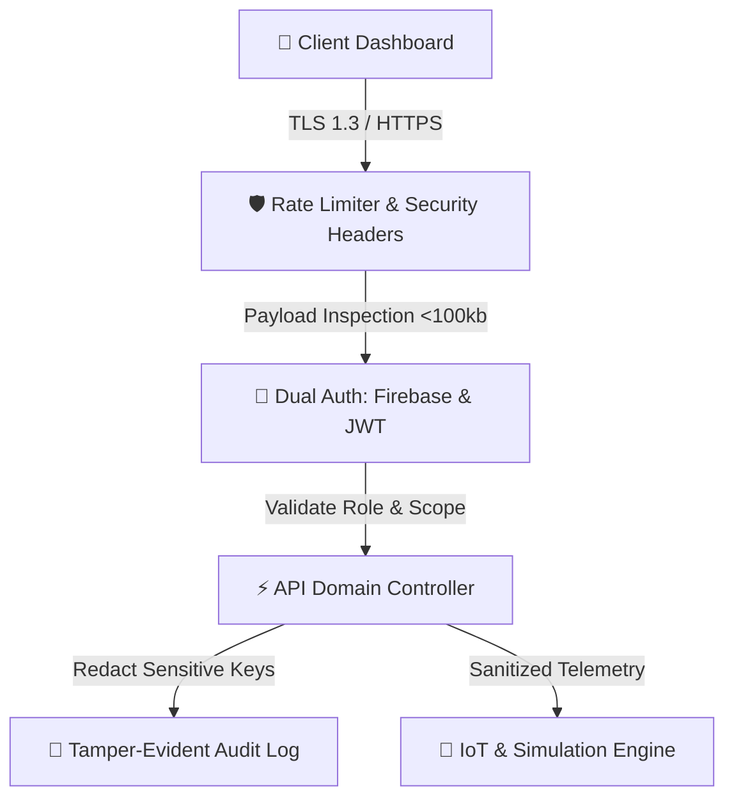

# 🛡️ Safe-Flow X Enterprise Security Policy & Architecture

Safe-Flow X implements defense-in-depth security mechanisms to protect urban traffic telemetry, user authentication credentials, AI copilot data pipelines, and smart city infrastructure control APIs.

---

## 📋 Table of Contents

1. [Security Architecture Overview](#-security-architecture-overview)
2. [Security Headers & Network Hygiene](#-security-headers--network-hygiene)
3. [API Rate Limiting & DoS Protection](#-api-rate-limiting--dos-protection)
4. [Authentication & Role-Based Access Control (RBAC)](#-authentication--role-based-access-control-rbac)
5. [OWASP Top 10 Mitigation Matrix](#-owasp-top-10-mitigation-matrix)
6. [WebSocket Real-Time Event Stream Security](#-websocket-real-time-event-stream-security)
7. [Audit Logging & Data Privacy](#-audit-logging--data-privacy)
8. [Vulnerability Disclosure & Breach Response SLA](#-vulnerability-disclosure--breach-response-sla)

---

## 🏗️ Security Architecture Overview

---

## 🔒 Security Headers & Network Hygiene

| Security Header | Directive / Value | Purpose |
| :--- | :--- | :--- |
| **Strict-Transport-Security** | `max-age=31536000; includeSubDomains` | Enforces TLS/HTTPS connections for 1 year |
| **X-Content-Type-Options** | `nosniff` | Blocks MIME-type spoofing & sniffing attacks |
| **X-Frame-Options** | `DENY` | Prevents iframe embedding and Clickjacking attacks |
| **X-XSS-Protection** | `1; mode=block` | Enables browser Cross-Site Scripting filtering |
| **Content-Security-Policy** | `default-src 'self'` | Prevents unauthorized script & resource execution |
| **Referrer-Policy** | `no-referrer-when-downgrade` | Prevents sensitive referrer data leakage |

---

## ⚡ API Rate Limiting & DoS Protection

- **Adaptive Rate Limiting**: Enforces a maximum rate threshold of **120 requests per minute** per IP address across all API endpoints. Excess requests receive HTTP `429 Too Many Requests`.
- **Payload Body Size Limit**: Requests are strictly capped at `100kb` (`express.json({ limit: '100kb' })`) to prevent memory exhaustion and Denial-of-Service payload spikes.

---

## 🔐 Authentication & Role-Based Access Control (RBAC)

### Dual Authentication Architecture
1. **Firebase Admin SDK**: Cryptographically verifies OAuth ID tokens (Google, GitHub, Email/Password).
2. **Local JWT Fallback**: Signs JSON Web Tokens using `HS256` encryption with 24-hour token expiration.

### Role Authorization Hierarchy
- **`citizen`**: Access to live traffic maps, eco-routing, AI copilot query, and gamification rewards.
- **`fleet_manager`**: Fleet analytics, emissions trends, and multimodal route optimization.
- **`emergency_operator`**: Priority corridor allocation, emergency preemption, and signal override control.
- **`admin`**: Full system digital twin simulation, scenario lab execution, system health controls, and security audit log access (`/api/audit`).

---

## 🛡️ OWASP Top 10 Mitigation Matrix

| OWASP Risk | Safe-Flow X Countermeasure |
| :--- | :--- |
| **A01: Broken Access Control** | Explicit server-side RBAC validation on protected endpoints (`/api/audit`, `/api/emergency/dispatch`). |
| **A02: Cryptographic Failures** | Salted password hashing with `bcrypt` (10 rounds) and `HS256` signed JWTs. |
| **A03: Injection (SQL/NoSQL/Command)** | Parametric query validation and memory-isolated array stores. |
| **A04: Insecure Design** | Principle of Least Privilege (PoLP) and decoupled provider abstractions. |
| **A05: Security Misconfiguration** | Strict CORS whitelisting and automated security header injection. |
| **A06: Vulnerable Dependencies** | Continuous dependency auditing via `npm audit` and Dependabot tracking. |
| **A07: Identification & Auth Failures** | Firebase OAuth token verification and strict rate limiting on `/api/auth/login`. |
| **A08: Software & Data Integrity** | Cryptographic verification of build packages and lockfile pinning (`package-lock.json`). |
| **A09: Security Logging Failures** | Real-time audit trail logging for all sensitive system state changes. |
| **A10: Server-Side Request Forgery (SSRF)**| Strict URL validation and local-only service binding for WebSocket telemetry. |

---

## 📡 WebSocket Real-Time Event Stream Security

- **Origin Handshake Validation**: WebSocket connection attempts verify standard CORS origins.
- **Connection Telemetry Heartbeat**: Automatic connection cleanup on client disconnect or ping/pong timeout.
- **Event Bus Isolation**: WebSocket payloads broadcast telemetry data (`traffic_update`, `emission_update`, `alert`) and exclude sensitive user session data.

---

## 📜 Audit Logging & Data Privacy

- **Audit Stream**: High-priority operations (`EMERGENCY_DISPATCH`, `SIGNALS_OPTIMIZE`, `DIGITAL_TWIN_SIMULATE`, `AI_COPILOT_QUERY`) are captured with user identity, role, timestamp, action, and metadata.
- **Zero Sensitive Data Logging**: Passwords, raw JWT tokens, Firebase API keys, and personal credentials are automatically redacted before logging.

---

## 🐛 Vulnerability Disclosure & Breach Response SLA

If you discover a potential vulnerability within Safe-Flow X, please report it through our responsible disclosure process:

1. **Security Contact**: `k.monishwaran123@gmail.com`
2. **Subject Line**: `[SECURITY VULNERABILITY] Safe-Flow X - <Brief Summary>`
3. **Response SLA**:
   - **Acknowledgment**: Within 24 hours
   - **Impact Assessment**: Within 48 hours
   - **Patch & Fix Deployment**: Within 72 hours

---

## 📄 License & Compliance

Distributed under the **MIT License**. See [`LICENSE`](LICENSE) for details.
